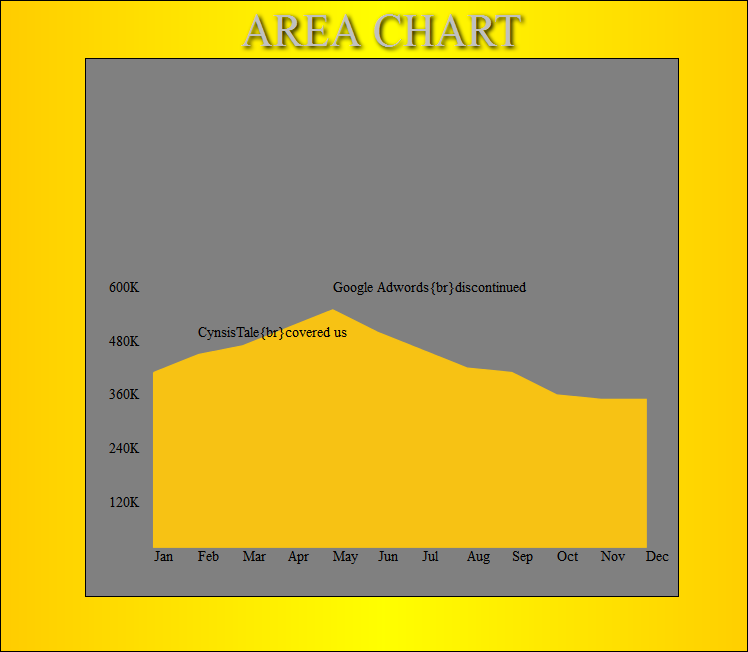
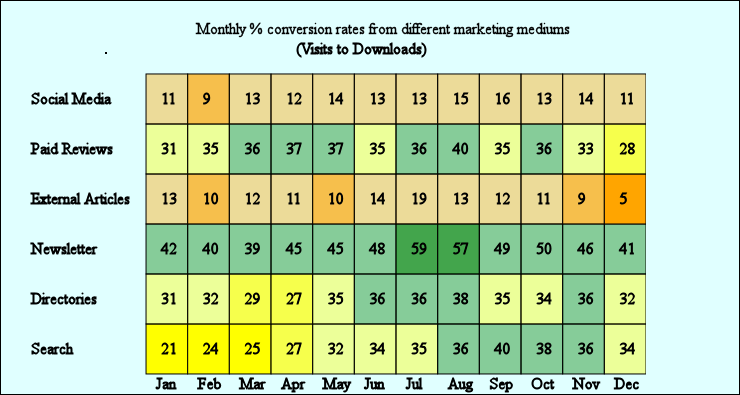
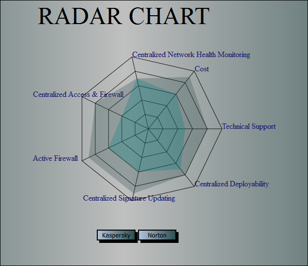

# Charts
This contains various kind of charts built with JavaScript,SVG and HTML

###Chart list
####1-Area Chart 
  Area charts are used to represent cumulated totals using numbers or percentages (stacked area charts in this case) over time. Use the area chart for showing trends over time among related attributes. The area chart is like the plot chart except that the area below the plotted line is filled in with color to indicate volume. 
  
</img>

   
####2-Heat Map 
  Heat maps originated in 2D displays of the values in a data matrix. Larger values were represented by small dark squares (pixels) and smaller values by lighter squares. 
   
</img>

 
####3-Radar Chart
  A radar chart is a graphical method of displaying multivariate data in the form of a two-dimensional chart of three or more quantitative variables represented on axes starting from the same point. The relative position and angle of the axes is typically uninformative. 
  The radar chart is also known as web chart, spider chart. 
  The radar chart is a chart and/or plot that consists of a sequence of equi-angular spokes, called radii, with each spoke representing one of the variables. The data length of a spoke is proportional to the magnitude of the variable for the data point relative to the maximum magnitude of the variable across all data points. A line is drawn connecting the data values for each spoke. 
  <b>Check out the live link hosted at<b> http://tub99.github.io/RadarChart/index.html
   
</img>

 
